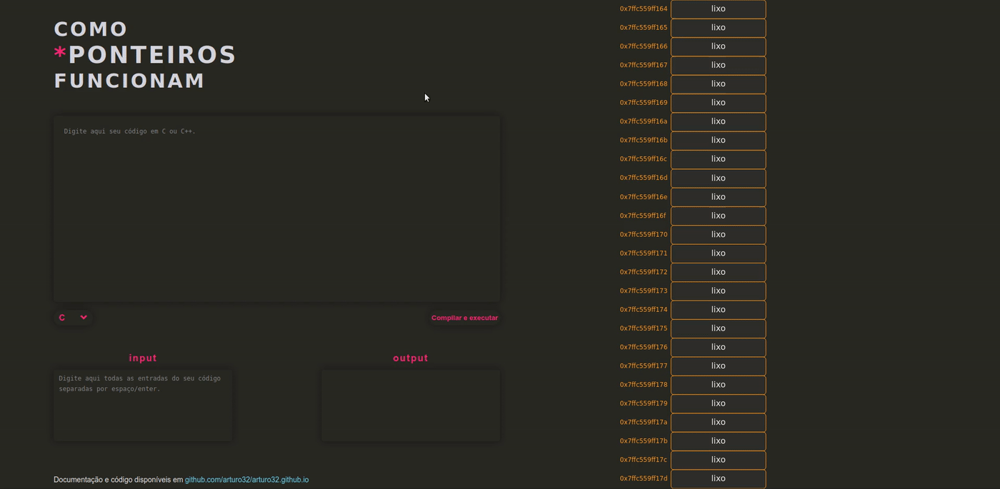

# Como\*PonteirosFuncionam
Um site que ajuda estudantes a entenderem como funcionam ponteiros. Disponível em <a href = "https://arturo32.github.io">arturo32.github.io</a>.

## Objetivo
Ajudar estudantes a entenderem os ponteiros na linguagem de programação C através de uma representação visual da memória do computador, que muda conforme o usuário digita seu código.

 

## O que foi feito
Atualmente, usando o RegEx em JavaScript, o site pode reconhecer:
* Declarações de ponteiros e variáveis regulares;
* Inicializações de ponteiros e variáveis regulares feitas ao mesmo tempo da declaração ou separadamente;
* Reatribuição de variáveis regulares e ponteiros;
* Reatribuição de variáveis regulares utilizando desreferenciamento de ponteiro;

Enquanto o usuário digita na caixa de texto, as variáveis que ele cria aparecem instantaneamente em uma representação da memória do computador, cada uma com um endereço de memória e seus respectivos atributos (conteúdo, tipo e nome). Se um ponteiro para uma variável é criado, uma seta aparece na memória, saindo do ponteiro e terminando na variável para a qual o ponteiro aponta, como mostrado abaixo: 

O site, como bônus, também possui um compilador online com caixas de texto de entrada e saída que funciona através de uma API fornecida por https://paiza.io/en. Em seu site eles dizem que o serviço da API não é garantido de forma alguma, mas parece que estou autorizado a usá-la para fins não comerciais (seus <a href="https://paiza.jp/guide/kiyaku">termos de serviço</a> estão apenas em japonês). Eu realmente deveria procurar outra API de outro site. Se você conhece alguma, por favor, me avise. 

## Como funciona
Expressões regulares. Muitas.  
Cada vez que o usuário digita enter, ponto e vírgula ou cola algo na caixa de texto, uma função é chamada (no código HMTL) para procurar por ponteiros e variáveis regulares usando RegEx (expressões regulares). Se forem encontradas, mais funções, com mais RegEx, são chamadas para separar o tipo, nome e conteúdo das variáveis e colocá-las em dois arrays de objetos: um de variáveis regulares e outro de ponteiros.  
Ambos têm elementos com três propriedades, mas o "conteúdo" do ponteiro, ao invés de ser um inteiro ou uma palavra, é um objeto do tipo regularVariable. Ele recebe uma referência de uma variável existente para poder modificá-la: quando um ponteiro é desreferenciado, por exemplo, o ponteiro pode facilmente acessar a variável para a qual ele está apontando e alterar seu valor.  
Depois de tudo isso, os arrays recebem endereços de memória arbitrários e são adicionados ao array allVars. Este array então é usado na função drawMemory onde seus atributos são mostrados na tela dentro das células da memória através de funções da biblioteca <a href="https://p5js.org/">p5.js</a>.

### API do Compilador
Toda a documentação da API está <a href = "http://api.paiza.io/docs/swagger/#!/runners/". >aqui</a>. Como não é muito amigável com usuários de APIs iniciantes (como eu!), vou explicar com detalhes como uso ele.  
No momento que o usuário clica no botão "Compilar e executar" uma solicitação POST é enviada, utilizando JQuery, para o endereço https://api.paiza.io/runners/create, com três atributos importantes em seu corpo: o "source_code" com todo o código feito pelo usuário, o "language", neste caso, C (a API pode suportar 31 linguagens de programação), e o texto de entrada que o usuário pode ou não ter digitado na caixa de entrada. A partir da resposta desta requisição é coletado um ID para a API saber quem eu sou na requisição seguinte.  
O próximo passo é enviar uma solicitação de GET para o mesmo link, com uma mudança no final (/get_details ao invés de /create). Esta solicitação de GET é enviada com o ID apresentado anteriormente. A primeira coisa a fazer com a resposta é verificar o parâmetro "status", pois ele irá dizer se a compilação terminou no servidor da API. Se não for o caso, a função chama a si mesmas após 100 milissegundos, até que o parâmetro "status" mostre que eles completaram a compilação.  
A segunda coisa a ser verificada são os parâmetros de erros! Existem dois: "build_stderr" (indica erros na compilação) e "result" (indica erros na execução). O primeiro vem com sua própria mensagem de erro, mas o segundo apenas indica "falha", então neste caso o "exit_code" deve ser verificado para saber que tipo de erro aconteceu (com um código numérico). Se algum destes erros acontecer, a mensagem é mostrada na caixa de texto de saída do site. Se nenhum deles acontecer, então o conteúdo do parâmetro "stdout" é mostrado na caixa de texto de saída.

## O que será feito
* Mudar o tamanho das células de memória de acordo com o tipo de variável que elas armazenam;
* Identificar a atribuição de variáveis com outras variáveis;
* Identificar e aplicar operadores aritméticos com números, variáveis e atribuições (ex. +=, \*=);
* Identificar e aplicar o operador de incremento tanto para as variáveis regulares quanto para os ponteiros; 
* Identificar arrays;
* Usar um "algoritmo diff" para uma experiência mais rápida em grandes códigos (?).
