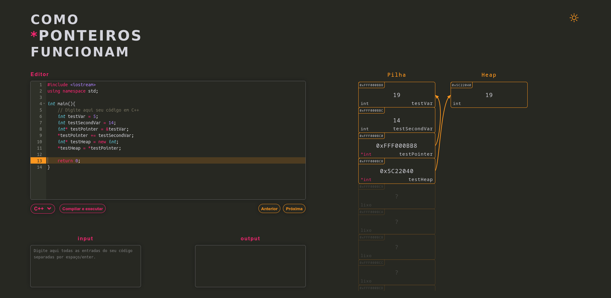

> *Este arquivo README também está disponível em português brasileiro. Clique em `README(pt-br).md` nos arquivos acima para lê-lo.*


# How\*PointersWork
A site that help students understand how pointers work. Available at <a href = "https://arturo32.github.io/HowPointersWork/">arturo32.github.io/HowPointersWork</a>.

<p align="center">

</p>

## Objective
To help students understand pointers in the C programming language through a visual representation of the computer memory, which changes as the user types its code.


## What will be done
* Show pedagogical text when clicking in some parts of the visualization;


## Docker 

```bash
docker build -f Dockerfile -t hpw-front .
docker run -p 8080:8080  -it hpw-front
```

## TODO
- Improve acessibility
    - How to "show" arrows to assistive technologies?;
    - Notify assistive technologies of change in memory (aria-live?);
    - "Show" highlighted line to assistive technologies in execution mode;
- Add levels of abstraction (one showing/ommiting memory adresses, other showing the values in binary, hiding the stack-heap separation);

*Icons from [reshot](https://www.reshot.com)
