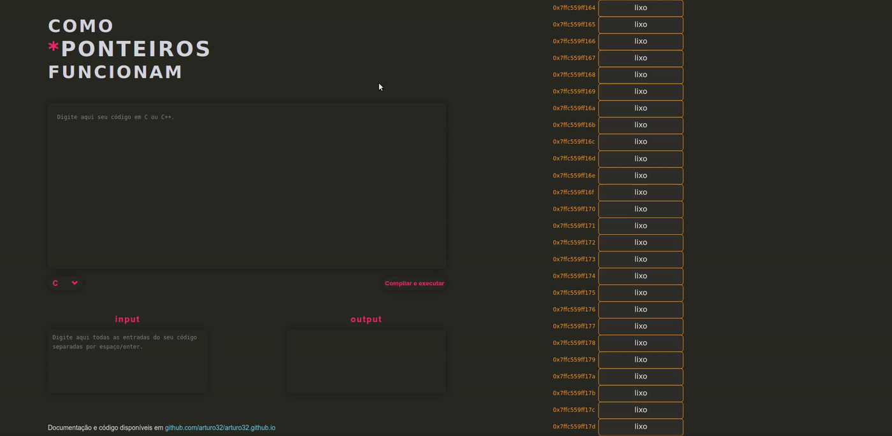

> *Este arquivo README também está disponível em português brasileiro. Clique em `README(pt-br).md` nos arquivos acima para lê-lo.*

# How\*PointersWork
A site that help students understand how pointers work. Available at <a href = "https://arturo32.github.io">arturo32.github.io</a>.

 

## Objective
To help students understand pointers in the C programming language through a visual representation of the computer memory, which changes as the user types its code.

## What has been done
The site, using RegEx in JavaScript, can currently recognize:
* Pointers and regular variables declarations;
* Initializations of pointers and regular variables done at the same time of the declaration or separately;
* Reassignment of regular variables and pointers;
* Reassignment of regular variables using pointer dereferencing;

As the user types in the text box, the variables that they create appear instantly in a representation of the computer memory, each one with a memory address and its respective attributes (content, type and name). If a pointer to a variable is created, an arrow appears in the memory, coming out of the pointer and ending in the variable that the pointer points to, as shown below: 

The site, as a bonus, also have an online compiler with an input and output boxes that works through an API provided by https://paiza.io/en. In their site they say that the API service is not guaranteed at all but it seems that I am allowed to use it for non-commercial purposes (their <a href="https://paiza.jp/guide/kiyaku">terms of service</a> are only in Japanese). I really should seek another API from another site. If you know one, please, let me know. 

## How it works
Regular expressions. Lots of them.  
Each time the user types enter, semicolon or pastes something in the text box, a function is called (in the HMTL code) to search for pointers and regular variables using RegEx. If found, more functions, with more RegEx, are called to separate the type, name and content of the variables and put them into two arrays of objects: one of regular variables and other of pointers.  
Both have elements with three properties but the "content" of pointer, instead of being an integer or a string, is an object of the type regularVariable. It receives a reference of an existing variable to be able to modify it: when a pointer is dereferenced, for example, the pointer can easily access the variable that it is pointing to and change its value.  
After all that, the arrays receive arbitrary memory's addresses and added to the allVars array. This array then is used in the drawMemory function where its attributes are shown in the screen inside memory cells through <a href="https://p5js.org/">p5.js</a> functions.

### Compiler API
All the API documentation is <a href = "http://api.paiza.io/docs/swagger/#!/runners/" >here</a>. As it is not very friendly with first time users of APIs (like me!), I will explain with details how I work with it.  
The moment that the user clicks the button "Compilar e executar" a POST request is sent, using JQuery, to https://api.paiza.io/runners/create, with three important attributes in its body: the "source_code" with all the code made by the user, the "language", in this case, C (the API can support 31 programming languages), and the input text that the user may or may not have typed in the input box. From the response of this request is collected an ID for the API know who I am in the next request.  
The next step is to send a GET request to the same link, with a change at the end (is /get_details instead of /create). This GET request is sent with the ID presented earlier. The first thing to do with the response is to check the "status" parameter, as it will tell if the compilation have finished in the API server. If is not the case, the function calls itself after 100 milliseconds, until the "status" parameter shows that they have completed the compilation.  
The second thing to check is the errors parameters! There are two: "build_stderr" (indicates errors in compilation) and "result" (indicates errors in execution). The first comes with its own message error but the second just indicates "failure", so in this case the "exit_code" must be checked to know what kind of error have happened (with a number code). If any of this errors happens, the message is showed in the output box of the site. If none of them happen, then the content of the "stdout" parameter is showed in the output box.

## What will be done
* Change the size of memory cells according to the type of variable that they store;
* Identify assignment of variables with another variables;
* Identify and apply arithmetic operators with numbers, variables and assignments (e.g. +=, \*=);
* Identify and apply the increment operator for both regular variables and pointers; 
* Identify arrays;
* Use a "diff algorithm" for a faster experience in big codes (?).

